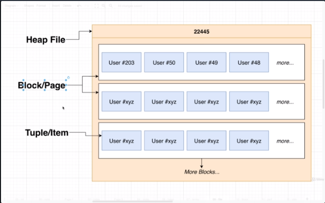
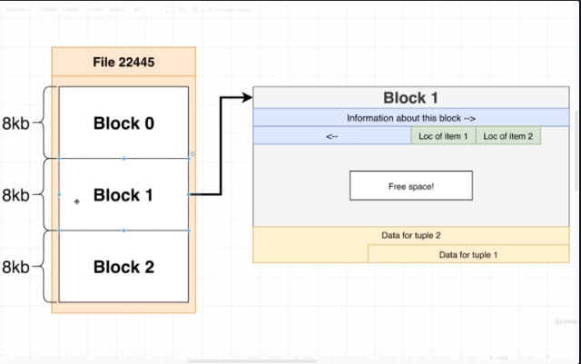

## Section 22 - Understanding the Internals of PostgreSQL

### Thinking about Performance

* You can get away with quick tips and hints
* Much easier to understand performance if you understand the internals
* Take a look at how data is stored and accessed
* Investigate at how indexes are stored and used
* Put these together to understand how queries are executed

We're going to start into dive into some really advanced stuff. This is where we get into Postgres. Performance. I could give you some quick tips, do XYZ, but at the end of day if you want to understand performance, you have to understand what Postgres is doing, and how data is stored on the disk.

Some of these videos in this section go into very, very deep detail. If you get confused or bored, just skip to the next section and come back to this at the end of the course.

### Where does Postgres store data?

Open up Query Tool.

Run `SHOW data_directory;`. So this is the folder on my personal computer where Postgres is installed and running from.

So let's open up that directory. Right now I just want to focus on the `instagram` database and where data for that is stored. All data for different databases are stored in `base` directory. We see different numbers. 

So let's run another query inside of pgAdmin:
```
SELECT oid, datname
FROM pg_database;
```

So from that query, `16728` is the `instagram` database on my computer. Your identifier will be different.

So I'm going to open up that directory and see a ton of different files. It seems like there are too many files for every table, and too few for one file for every row.

Well, let's run another query;
`SELECT * from pg_class;`

Each of these different rows contains information about one of those different files that we're looking at. Each file in turn represents one individual object in our database. Objects in our database are not just tables. Indexes, sequences, primary keys, etc.

Right now let's just to find our users table is stored. I can took at our `relname` column and find the row with `users`. And we get an `oid` for that row, which is `22445` for my computer. You might have a different identifier. And we find a file with id of `22445` and that file contains all of the data for my entire `users` table.

So now we're going to investigate how data is stored in that file.

We need some terminology to understand that file.

* __Heap__/__Heap File__ -> File that contains all the data (rows) of our table
* __Tuple__/__Item__ -> Individual row from the table
* __Block__/__Page__ -> The heap file is divided into different 'blocks' or 'pages' and each page/block stores some number of rows


So here is a diagram of file `22445`.



So here is a diagram of file 22445. The entire file is a heap file. The heap file is subdivided into blocks or pages. Each block or page stores several tuples/items/rows.

By default, each block/page is 8kb in size. The next one, regardless of many rows it has, is always 8kb large. So at this point in time we have an idea of what a heap file is.

But why? Why 8kb regardless of how many items? Why blocks at all? Why not store all users inside of the heap file?

Really going to get a good idea of why these block things exist in next video.

### Block Data Layout

We're going to go one step deeper. This video is going to get crazy because we're going into a fine level of detail.

So we're looking at File 22445. Inside that file, collection of different blocks, assigned a number, starting from 0. Each block is 8kb.

Each block has this kind of structure. So let's look at Block 1.



Your hard disk stores data in binary as 0s and 1s. We can kind of imagine we can look at some collection of 0s and 1s. First couple of 0s and 1s store some information. Maybe the next couple of 0s and 1s are dedicated to storing some other kind of information.

First section contains information about the block. The next section contains metadata about the rows themselves. Then there's free space (0s and 1s not currently used). Finally at the end is the actual data itself.

### Heap File Layout

You almost definitely _do not_ need to watch this video. I'm only putting this to give you a better idea of the engineering effort gone into Postgres and gives you a better well-rounded picture of what's going on.

We are going to map out how PG stores data at the binary level.

So we're going to go to the docs:
https://postgresql.org/docs/current/storage-page-layout.html

This is all about how Postgres stores data in one individual page. The documentation maps the layout in terms of bytes and bits.

Now we need a Hex Editor to be able to view the raw binary that makes up that heap file.

So let's open up file `22445` with a Hex Editor.

The primary interface is the numbers and letters in the middle. These are hex values. Each hex value of 2 numbers/letters is one byte of information. Hexadecimal is basically shorthand for binary, a particular pattern of 0s and 1s. An easier way to visually understand 0s and 1s.

You'll notice there are 16 columns across. That's not how it's represented in the file, but helping us visualize it better.

There's another table called Decoded Text. The information there is if you tried to read all this binary as characters. Most of the time Decoded Text column is not really useful unless this binary is meant to store actual text values.

If we scroll to the very top, we're looking at the start of Page 0. If we counted up 8192 bytes, 1, 2, 3, 4, ...,, 8192 we would get to Page 1.

Next thing, I took a screenshot of that data. We're going to take a look at the meaning of every sequence of bytes. 

We're going to go back to the docs with "Overall Page Layout" but ignore "Special space" so we have 4 important items and map up the first 24 bytes. Let's just scroll down to "PageHeaderData Layout" in the docs to understand what each grouping of bytes represents.

So we have `pd_lsn` (8 bytes), `pd_checksum` (2 bytes), `pd_flags` (2 bytes) and then we have `pd_lower` and `pd_upper`. In our table `pd_lower` is 0028 and `pd_upper` is 0100, which is 40 and 48 in decimal. And that matches the size of a page, 8 kilobytes.

...

Note: I stopped here because it really is just 20 more minutes of analyzing all the bytes in the `22445` table.
