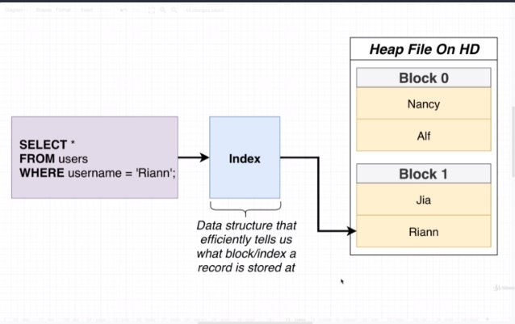
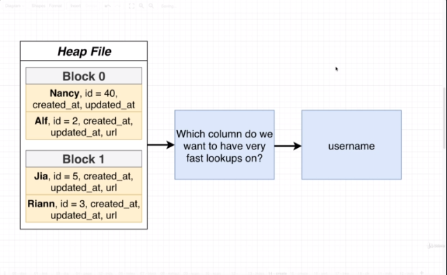
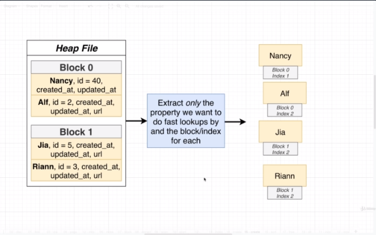
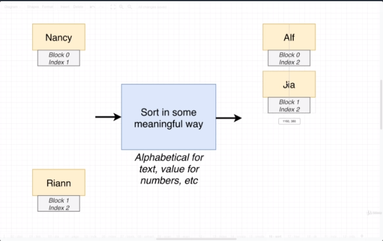
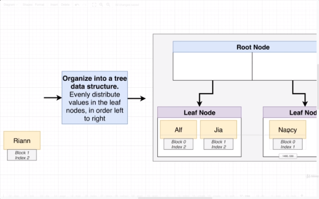
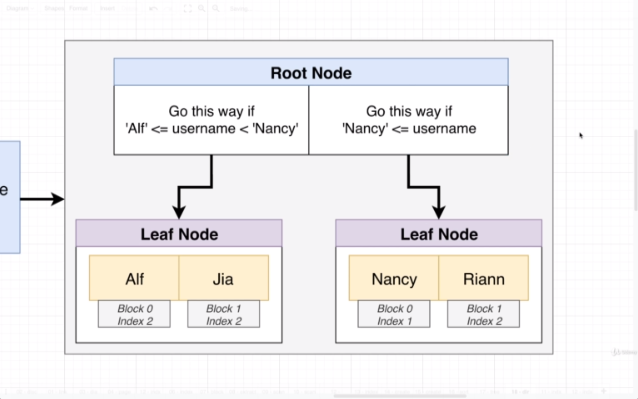

## Section 23 - A Look at Indexes for Performance

### Full Table Scans

So we've seen how Postgres stores records inside of individual blocks inside of a heap file. So who cares? Why does it make a difference? Well, we'll run through a query and see.

Let's run a query:

```sql
SELECT *
FROM users
WHERE username = 'Riann';
```

__Heap File__

| Block 0 |
|---------|
| Nancy   |
| Ai      |

| Block 1 |
|---------|
| Jia     |
| Riann   |

So I want to imagine we have a heap file like this. We have 2 blocks, Block 0 and Block 1. Let's imagine what would happen if we ran a query ilke this. When data is inside of a heap file on your hard disk, Postgres can't take a look of that in-place. First, Postgres needs to load all the different users into memory. Once they're in memory, Postgres can do further querying.

| Memory (RAM) |
|--------------|
| Nancy        |
| Alf          |
| Jia          |
| Riann        |

So we might walk through every single one of the users until we find one named 'Riann'. Now anytime we are loading up information from our hard drive to memory, that has a large performance cost. So as data engineers, we try to minimize data being moved between our hard drive and memory. This is a really big drive when it comes to performance. And we're going to spend a lot of time to understand how we can limit how much data is taken out of a heap file and placed in memory.  Now, on top of this, once data is loaded into memory, we must execute a search record by row. Once information is in memory, we have to walk through each row until we find all rows that satisfy the criteria.

Now, any time we are loading up a ton of info out of table and iterating over tables one by one, we refer to that as a full table scan. So a __full table scan__ is whenever PostgreSQL has to load up a ton or even possibly all the different rows out of a heap file into memory and then execute an iteration over those rows on some number of records. You're going to see references to full table scans in a lot of different blog posts and articles around Postgres performance. A lot of articles will say a full table scan will be 100% a low-performing query.

In reality, you do not always run into poor performance when you are doing a full table scan. There are some scenarios where a full table scan is preferable to any alternative. Regardless, full table scans, anytime we see Postgres is doing them, investigate and see if we can search for data in some different manner.

So here, we are looking at a query that would result in a full table scan. So that's exactly what we're going to do in the next video.

### What's an Index

In the last video, I made it seem that we could load a record without having to load all records into memory.

Maybe we had some outside tool that could tell us where every user was located inside the file. That thing could tell us where user Riann is. "_Oh yeah, User Riann is at Block 1 Index 2._" We could just load this block by itself. Load just that block by itself, just get user Riann without fetching extraneous information.

Well, naturally, we do have a tool like this. It's called an __Index__. An Index is a data structure that tells us what Block and Index a record is stored at. It's an external record that tells us exactly where some records are stored in a heap file.

Best to understand Indexes by knowing how an Index is created.

### How an Index Works



1) We find out which column we want to index on, the column we want to have a very fast lookup on. We wanted to find a specific user based on a specific username. Whenever we create an index, we create it on a very specific column.

Now we can technically have an index that takes into account multiple different columns for each row, but not going to worry about that for now.



2) We're going to look at our heap file and look for every single row and extract that _only_ the one property for that column we picked in Step #1. Nancy's username is "Nancy" and we will record that we found it at Block 0 Index 1, Alf is found at Block 0 Index 2. Jia is found at Block 1 Index 1. We continue to repeat that same process.



3) We're going to take look at all the values we have from Step #2 and sort them in some meaningful way. We have strings or text we would sort these alphabetically. For dates, we'd sort from earliest date to newest date. We can do ascending or descending. Now we get Alf, Jia, Nancy, Riann.



4) Now the next step is to take that list into a tree data structure. When we insert records into the tree, distribute records evenly through leaf nodes. Take Alf and put leftmost position of leaf node. Put Jia right next to Alf. Next is Nancy in the next leaf. And then Riann next to Nancy. Now notice I preserved alphabetical order.



5) Add some helpers to the root node. You'll notice in the Root Node we got white boxes. We're going to put some instructions here whether someone executing a query should go down this leaf node. I'm going to list inside here in the Root Node, what values exist inside the Leaf Node.



Alright. Something really important I want to point out about Index. We were able to find record without loading up majority of records inside heap file. We didn't need to visit leaf node or left side. Skip a huge portion of entire search portion by using inequality set up ahead of time. What Index does for us. Allows us to find some particular record very efficiently and pointed where that record exists inside the heap file.

### Creating an Index

We're going to create an Index for our users table that involves the username column.

```sql
CREATE INDEX ON users (username);
```

So the syntax is CREATE INDEX ON _table_ (_column_).

To verify it, in pgAdmin, we can go to instagram, then to Tables, then `users`, then Indexes. You may need to refresh Indexes.

So the index table was given a name of `users_username_idx`. If you want to apply a manual name, you put it in between `INDEX` and `ON` in the statement. I do recommend you keep the convention because that way you don't have to look it up.

So now in theory queries on the username of the users table should be fairly quick.

But before, I want to show you how you can delete an index:
```sql
DROP INDEX users_username_idx;
```

Now I'm going to recreate the index so we can test it out.

### Benchmarking Queries

We've got our index in place but does it actually speed up queries? I'm going to give you a keyword to figure out how much a query takes. Now pgAdmin does tell you number of milliseconds an operation takes, but it's misleading, because that includes travel time from/to pgAdmin interface. It includes network travel time (not important) and execution time.

I'm going to do a very typical query:
```sql
SELECT *
from users
WHERE username = 'Emil30';
```

I got one row. Okay now we need to figure out to figure out how long it took. We're going to go over `EXPLAIN ANALYZE` in a future video, but for now let's run it.

```sql
EXPLAIN ANALYZE SELECT *
from users
WHERE username = 'Emil30';
```

The `Execution Time` is what we want to look at, which is .03 ms. Now I might want to run it a couple more times just to get a number of values, and it looks like it's stabilizing at .075 ms. Now that is really really fast. This is running the query with the index. Unbelieveably fast.

Now I'm going to drop the index and do the same command. Now the index is gone, and theoretically we can no longer do fast lookup. And now we'll take at look how long it. `1.249` ms. 1.249/0.075. So that is a 17x improvement.

Without a doubt, an index has a huge tremendous performance benefit. So it seems like we should use indexes all the time. So maybe we should use them all the time? Well, not really. There are cases where indexes can actually slow down your database.

### Downsides of Indexes

It might seem like we should an index for every column of every table. But that is definitely not what we do on any real database. Quick reminder. We were creating some tree data structure. For every row of our table, we extracted one piece of information along with a pointer to some location inside of our heap file. We now are storing some piece of information and a pointer. It takes some hard drive space to store the index. So we can figure out how much space the index takes.

```sql
SELECT pg_size_pretty(pg_relation_size('users'));
SELECT pg_size_pretty(pg_relation_size('users_username_idx'));
```

We get 880kb vs 186kb. These are trivial amounts of space. If you develop an application that stores a ton of data, you might have a table with 80 GB of data, so you would have 18 GB just to store this additional index. Even 18 GB might not seem that large. But if you relying on AWS to host Postgres, the amount of money you pay for storage space is rather large. So in some cases, you can save a ton of money by not stuff extra values inside your database. Now paying some money is not a big deal if you actually are gaining some big performance benefits.

Other downsides on Indexes:
* Can be large! Stores data from at least one column of the real table
* Slows down insert/update/delete - the index has to be updated!
* Index might not actually get used!

### Index Types

Anytime we run the `CREATE INDEX` command we are creating a very specific type of index. The most common one and the one you want a majority of the time is a B-Tree Index. B-Tree Indices is what you want to create the vast, vast majority of the time. I'm just creating this video to let you know other indexes exist.

* B-Tree -> General purpose index; 99% of the time you want this
* Hash -> Speeds up simple equality check
* GIST -> Geometry, full-text search
* SP-GIST -> Clustered data, such as dates - many rows might have the same year
* GIN -> For columns that contain arrays or JSON data
* BRIN -> Specialized for really large datasets

### Automatically Generated Indexes

It turns out you've been working with indexes throughout this course.

| hashtags   |
|------------|
| id         |
| created_at |
| title      |

`hashtags_pkey` -> `id`
`hashtags_title_key` -> `title`

* Postgres automatically creates an index for the primary key column of every table
* Postgres automatically creates an index for any `unique` constraint
* __These don't get listed under `indexes` in PGAdmin!__

```sql
SELECT relname, relkind
FROM pg_class
WHERE relkind = 'i';
```

`pg_class` lists all objects within our database. A `relkind` of `i` means that this object is an index. So we are looking at all the indexes. `users_pkey`, `posts_pkey`, etc. Rather than using pgAdmin, you could just run this query to find all indexes. 

Rule of thumb is we don't have to create an index for any primary key column or any column with a unique constraint.

