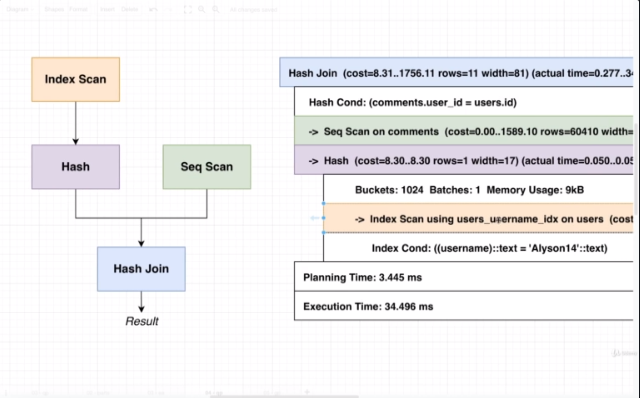

## Section 24 - Basic Query Tuning

### The Query Processing Pipeline

So we've spent a lot of time with learning how indexes work and how to evaluate whether a given column should be indexed, but we still don't know when we should use an index. We will evaluate what makes a good query or what makes a bad query.

Big Diagram here.

```sql
SELECT *
FROM users
WHERE username = 'Alyson14';
```

So there's a Parser, Rewriter, Planner and an Executer.

1) So first comes the __Parser__. Immediately Postgres is going to try to take all the characters of the string and figure out meaning of every character and make sure what you wrote is valid SQL. Then it's going to build a Query Tree. In Query Tree, we have referencesthe different parts of the query.

2) Query Tree is then handed off to __Rewriter__. Certain parts could be executed more efficiently, Rewriter makes small changes.

3) After that, Query Tree moves to __Planner__. This is the big thing. Look at what you are trying to fetch and come up a few plans or strategies to actually get that information.

In that case, trying to get information out of `users` table using `username`.  So it may say we might get that information efficiently by looking at the `users_username_idx`. It might come up with another plan to Fetch all users and search through them. It then figures out which plan is fastest.

4) Then the __Executor__ actually runs the query.

So again, the Planner is what we have a lot of influence over. Output of Planner to understand what makes a fast query and what makes a slow query.

### Explain and Explain Analyze

So we're going to take a look at the Planner stage.

* `EXPLAIN` -> Build a query plan and display info about it
* `EXPLAIN ANALYZE` -> Build a _query plan_, __run it__, and display info about it.

`EXPLAIN` kind of tells what Postgres plans to do. `EXPLAIN ANALYZE` does the same thing but then executes it.

We're not going to use this in production data. These are only for used for performancne evaluation. The reason is because it doesn't actually return the rows coming out of your query.


```sql
SELECT username, contents
FROM users
JOIN comments ON comments.user_id = users.id
WHERE username = 'Alyson14';
```

Let's run that and make sure the output seems correct. Let's now that with `EXPLAIN`.

```sql
EXPLAIN SELECT username, contents
FROM users
JOIN comments ON comments.user_id = users.id
WHERE username = 'Alyson14';
```

```sql
EXPLAIN ANALYZE SELECT username, contents
FROM users
JOIN comments ON comments.user_id = users.id
WHERE username = 'Alyson14';
```

If you're running plain SQL, you can always use `EXPLAIN ANALYZE`. But with pgAdmin, you can use a feature to run `EXPLAIN ANAlYZE` for you. Let's just run the SQL above without the `EXPLAIN ANALYZE`. Two buttons to the right of the play button there's the explain analyze button. And we get this nice diagram showing the Query Plan. Now, if you use this feature of pgAdmin, you'll want to click the drop down next to the button and enable everything.

### Solving an Explain Mystery

Hash Join  (cost=8.31..1756.11 rows=11 width=81)
  Hash Cond: (comments.user_id = users.id)
  ->  Seq Scan on comments  (cost=0.00..1589.10 rows=60410 width=72)
  ->  Hash  (cost=8.30..8.30 rows=1 width=17)
        ->  Index Scan using users_username_idx on users  (cost=0.28..8.30 rows=1 width=17)
              Index Cond: ((username)::text = 'Alyson14'::text)


Now out of all these different rows, some have different arrows at the start. Each of these rows with an arrow are referred to as a __Query Node__. So this is some step where we are trying to access some data stored in the database or do some processing. So that is true of all the rows with an arrow. The very top line is also a Query Node as well.



Now the way we read this is by going to the innermost rows. Trying to access data and emit/pass data up to nearest parent that has an arrow.

So Index Scan is accessing some information on the hard disk, passing thatinformation to the Hash Node, which is passing output to Hash Join. At the same time, we're going to step inside of Sequential Scan. Access all different rows inside a table, and pass up all those rows up to Hash Join. Hash Join combining output from Hash and Seq Scan nodes. Finally output of Hash Join is our final result.

Lets take a look at `Hash Join  (cost=8.31..1756.11 rows=11 width=81)`.

`Hash Join` - How this node is generating data
`(cost=8.31..1756.11` - Amount of processing power required for this step
`rows=11` - A guess at how many rows this steps will produce
`width=81)` - A guess at the average number of bytes of each row

The last two numbers are quite interesting. Let's run the query with just `EXPLAIN`. You'll notice we have still have rows and width here. How does Postgres know if we have not accessed the actual `users` table? It turns out Postgres keeps some statistics about what's going on inside your tables.

Let's run this query:
```sql
SELECT *
FROM pg_stats
WHERE tablename = 'users';
```

So let's take a look. We are going to told that these all columns in the users table. So all this information allows Postgres to make a guess.

