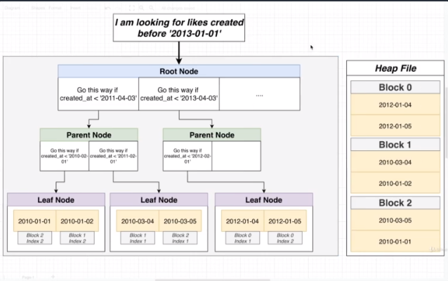

## Section 25 - Advanced Query Tuning

### Developing an Intuitive Understanding of Cost

This video is going to be a little bit long. Walk away with a good idea of what cost is about. 

__Working definition for 'cost':__
Amount of time (seconds? Milliseconds?) to execute some part of our query plan

_Not super accurate, but good enough for now._

I want to take the query we had before and think about this Planner step.

```sql
SELECT *
FROM users
WHERE username = 'Alyson14';
```

How can the Planner figure out which plan is fastest without running them?
* Look at `users_username_idx` then get users?
* Fetch all users and search through them

So I put down a series of steps of how I think these queries are going to be executed.

__Look at `users_username_idx` then get users?__
* Find the IDs of users who have username of 'Alyson14'
  * Get root node (ex. Go this way if 'Alf' <= username < 'Nancy')
  * Jump to some random child page
  * Process the values in that node
* Open users heapfile
* Jump to each block that has the users that we're looking for
* Process the appropriate users from each block.


__Fetch all users and search through them__
* Open the `users` heap file
* Load all users from the first block
* Process each user, see if it contains the correct username
* Repeat the process for the next block

Now I want to go some step deeper, some sort of cost or value to each of these. How can we get to some numeric value? Well, if we had to assign a score, think about number of different pages off the hard drive.

For "Find the IDs of users", it'd probably fetch just one random page (technically 2 including root node but ignore that). For "Jump to each block that has the users" and "Process the appropriate users", it'd probably fetch just one random page.

For "Load all users" to "Repeat the process", we'd do it once for every page, so it'd fetch all pages in the `users` heapfile. So number of pages in `users` heapfile.

So this might seem like a straightforward calculation. 2 vs 100 pages (assuming we have 100 pages in the heapfile). Before we run away with that, quick thing.

So for the index stuff, we're talking about fetching random pages. There's a little difference. When randomly jumping over hard drive, that has a performance penalty versus loading up data sequentially. So the 2 random pages might actually take a little longer for run.

Here's my idea. Let's assume that loading a _random_ page takes __4 times longer__ than loading up pages sequentially. Big assumption here, let's run with it.

(2 pages loaded in random order) * 4 = 8
(110 pages loaded sequentially) * 1 = 110

To point out quickly, 8 and 100 don't have any real units associated with it. It's some score associated with pages, but there's no unit.

We have `* 1`, because this is like our baseline value.

Now, is this a scientific comparison? No, but it's better than nothing. So there's a factor of 13 here so it's a good enough guess.

### Calculating Cost by Hand

In the last video, we took these 2 alternative ways and assigned a score, and boiled down to one score.

Now I want to repeat that same step, but we're going to repeat it for one specific line. I want to calculate score for Seq Scan on comments).

Now in this case not debating. Just take a guess on how to load all comments.

My guess as to what goes on behind the scenes:

__Fetch all comments__
* Open the comments heap file
* Load all comments from the first block
* Process each comment in some way
* Repeat the process for the next block

I want try to assign processing some comment in some way. Make some real big estimate at long how it takes to process.

__Fetch all comments__
* Open the comments heap file
* Load all comments from the first block
* Process each comment in some way - 60410 rows
* Repeat the process for the next block - 985 pages

Processing a single row is probably really, really cheap compared to loading an entire page from the hard disk. So we need some formula.

So `(# of pages) * 1.0 + (# of rows * 0.01)`. So huge guess here that processing 100 rows is equivalent to processing 1 page.

`(985) * 1.0 + (60410) * 0.01 = 1589.1`

Now big reveal here. Take a look at our query plan. We just calculated the  exact costs for loading comments.

What does this all mean? We had made guesses about how information is loaded up, how many pages laoded up sequentially vs random, etc. We tried to assign at how expensive loading a random page to loading up pages sequentially. All relative to loading up pages sequentially. Processing a row is 1/100th compared to loading up page. Number doesn't necessary have meaning, but allows us to assign a score to a single distinct operation of query plan.

That's what cost is all about. Vague ballpark value of how expensive this step is compared to another step, and comparing the cost of one Query Plan to another Query Plan.

### A touch More on Costs

Full equation for calculating cost of Query Plan:
```
Cost =
  (# pages read sequentially) * seq_page_cost
  + (# pages read at random) * random_page_cost
  + (# rows scanned) * cpu_tuple_cost
  + (# index entries scanned) * cpu_index_tuple_cost
  + (# times function/operator evaluated) * cpu_operator cost
```

So I want to show you where these cost factors are coming from:
https://postgresql.org/docs/current/runtime-config-query.html

Go to "Planner Cost Constants". These won't change inside your database unless you specifically change them manually.

`estimate` is not a great term here, but essentially some kind of abritary factor to gauge how expensive it is to sequentially gauge how much cost to cost one sto sequentially read page.

`random_page_cost` is relative to `seq_page_cost`.

We've got `cpu_tuple_cost` for CPU processing power for processing one tuple. And so on. This should make it really clear that everything is based upon sequentialy page cost. `seq_page_cost` being 1.0 means that's our baseline.

There's a green "Tip" box in the documentation explains why you might change the defaults for these constants.

One last thing. You're going to very frequently see this equation abbreviated in blog posts as this:

```
Cost =
  (# pages read sequentially) * seq_page_cost
  + (# rows scanned) * cpu_tuple_cost
```

That's because a lot of blog posts are showing how to calculate the cost of a sequential read. Think about what happens in a sequential read. Everything else in the equation goes to 0 and we're left with just those 2 terms.

But in reality, there's all these other terms.

Even this equation is technically not the full story. Paralle query read. `parallel_setup_cost`, `parallel_tuple_cost`. But I think you're getting enough of an idea. There's going to be a different variation of this equation.

### Startup vs Total Costs

We're seeing two values in `(cost=8.31..1756.11`

The first value is the cost for this step to produce the first row.

The second value is the cost for this step to produce all significant rows.

Imagine up opening a page and processing all different rows. We thhen have some number of rows ready to be processed by next step in chain. Immediatelly start to provide that set of rows to the next step (`Hash Join`).

We're doing some kind of long-processing operation. In some cases, process some row, send off to next step, and next step might be immediately able to start do with that row. The lower bound cost is when the step gets the very first piece of information and passes it off.

Totally honest about. Seq Scan has a lower bound cost of 0. Essentially free in theory to emit very first row. Now you and I know it has to load up page. Getting the very first row has some cost but the cost is shown here as 0. But I don't know why that cost is indicated as 0. I don't know why, but that's what it is.

In Hash, the lower bound cost is equal to upper bound cost. That means that step can't emit rows one by one. It has to process everything in a batch and then emit.

Now why do we care about Startup Cost vs Overall Cost? In some cases, in theory, we could speed things up by trying to make use of processing steps where we can do some immediate work on some rows.

### Costs Flow Up

One last quick thing. Very quick little item. I want to just have one standalone video. Let's look at a cost of a Hash Join. Hash Join has a startup cost of 0. You'll notice in the Query Plan it has a startup cost of 8.31. We calculate of the cost by the sum of all child nodes. So immediate cost of Hash is 8.3, immediate cost of Seq Scan is 0 and immediate cost of Index Scan is 0, and the cost of the Hash Join itself so 0 + 8.3 + 0 = 8.3. But the actual cost of the Hash Join is a little bit above 0, so it's 8.31.

### Use My Index!

```
SELECT *
FROM likes
WHERE created_at < '2013-01-01';
```

In total our likes table has 750k rows. Hey alright there's our data. If we do a `COUNT(*)`, we get 64k rows.

Now let's do `EXPLAIN`.

```sql
EXPLAIN SELECT *
FROM likes
WHERE created_at < '2013-01-01';
```

Now we have to do a Seq Scan.

Let's try creating an index.

```sql
CREATE INDEX likes_created_at_idx ON likes (created_at);
```

Let's run the `EXPLAIN` query again. New analysis. We have a Bitmap Scan and Bitmap Heap Scan. Not going to worry about what that is just right now. Now because the likes table is so large, we get a multi-level index. We get parent nodes inserted in here which are inserted in between in root node and leaves.



Now let's modify our query slightly.

```sql
SELECT *
FROM likes
WHERE created_at > '2013-01-01';
```

Now let's do the `COUNT(*)` again, We were getting 64k before, now we're getting 688k.

Let's use `EXPLAIN` again. Hold on. It's doing another Sequential Scan. But we have an index this time. Why is that? It comes down we're fetching a tremendous amount of information. The index helps when we're trying to find some specific small set of records. 

We're trying to find 70% of information from our table. If we were to make use of the index. Because of that, with the index, end up having to visit 70% of these leaf nodes, take different blocks and open up a tremendous amount of blocks, and pay penalty for random access. Postgres realizes rather than going through the hassle. You know what, probably easier to open up heap file directly and go through sequentially.

Even if you have an index in place, Postgres will decide it's too much trouble.

When you write any query, use `EXPLAIN` and see it actually uses the index you actually created. If it's not using the index, might as well drop the index, because it's not giving any benefit.

You might see a lot of scenarios, on StackOverflow, "Hey, Postgres isn't using my index. How can I force Postgres to use my index?" You don't want to force Postgres to use your index. That's the answer.
