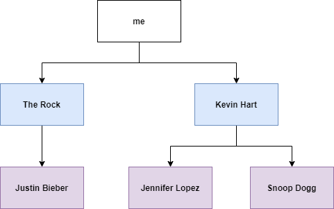
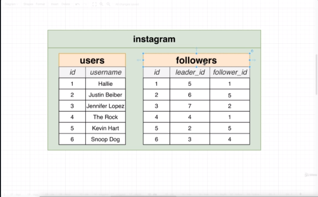

## Section 27 - Recursive Common Table Expressions

### Recursive CTEs

__Important Notes on Recursive CTEs__
* Very, very different from simple CTEs
* Useful anytime you have a tree or graph-type data structure
* Must use a 'union' keyword - simple CTE's don't have to use a union!
* __This is super, super advanced. I don't expect you to be able to write your own recursive CTEs - just understand that they exist!__

```
WITH RECURSIVE countdown(val) AS (
  SELECT 3 AS val
  UNION
  SELECT val - 1 FROM countdown WHERE val > 1
)
SELECT *
FROM countdown;
```

What's going on here and why would we use it?

### Recursive CTEs Step-By-Step

You've notice we've got that `UNION` keyword. We have one `SELECT` above the union. That's referred to as the initial or non-recursive query. Then immediately after the union is the recursive query.

```
WITH RECURSIVE countdown(val) AS (
  SELECT 3 AS val -- Initial, Non-recursive query
  UNION
  SELECT val - 1 FROM countdown WHERE val > 1 -- Recursive query
)
SELECT *
FROM countdown;
```

* Define the results and working tables
* Run the initial __non-recursive statement__, put the results into the results table and working table
* Run the __recursive statement__ replacing the table name 'countdown' with areference to the working table
* If recursive statement returns some rows , append them to the results table and run recursion again
* If recursive statement returns no rows stop recursion

| Results Table | Working Table |
|---------------|---------------|
| val           | val           |
| 3             | 3             |

```
WITH RECURSIVE countdown(val) AS (
  SELECT 3 AS val
  UNION
  SELECT val - 1 FROM WORKING_TABLE WHERE val > 1
)
SELECT *
FROM countdown;
```

Take the val column from inside the working table, subtract 1 from it. That gives us 2. That's the output of running the recursive query. Then we check if the recursive statement returned row. It did so we're going to append 2 to the Results Table.

| Results Table | Working Table |
|---------------|---------------|
| val           | val           |
| 3             | 3             |
| 2             |               |

So now we're going to replace the results of working table with the result from executing the recursive query which was 2.

| Results Table | Working Table |
|---------------|---------------|
| val           | val           |
| 3             | 2             |
| 2             |               |

Now we're going to do the same thing.

| Results Table | Working Table |
|---------------|---------------|
| val           | val           |
| 3             | 2             |
| 2             |               |
| 1             |               |

| Results Table | Working Table |
|---------------|---------------|
| val           | val           |
| 3             | 1             |
| 2             |               |
| 1             |               |

So now val is 1 and val is no longer greater than 1, so the recursive statement returns no rows so we stop the recursion. Now we're going to rename the Results Table to `countdown` and now we're going to make this resulting table accessible to the result of the query, which is:
```sql
SELECT *
FROM countdown;
```

So we should see a column name of `val` with rows with values 3, 2 and 1. So let's run the original query. And yes, that's what we get.

### Why use Recursive CTEs?

Let's take a look at a much more realistic example with our `instagram` database. Instagram is showing me who I should follow. Why are justinbieber, snoopdog, jlo being recommended for me to follow.

I am currently following The Rock and Kevin Hart. The Rock is following Justin Bieber. Kevin Hart is following Jennifer Lopez and Snoop Dogg.



So Instagram makes a really big assumption. If I'm interested in these people, and these people I'm interested in, are following these people, then I should be interested in Justin Bieber, Jennifer Lopez and Snoop Dogg.

So get a list of suggestions, we would have to write out a query to see who some user is following, find those people, and find who they are following in turn. Now we might be able to do that using a `JOIN` statement. However, there's something else to keep in mind. I'm looking at big list of users. I might need to load up some additional number of users if I get to the bottom of the current list.

So if I don't care about Justin Bieber, Jennifer Lopez or Snoop Dogg, maybe we could go one step further. Justin is following Miley Cyrus. Jennifer is following Justin Timberlake. Snoop Dogg is following Selena Gomez. So maybe I should be interested in these people. But maybe I'm not interested, then we should go even further down and see who Miley, Justin and Selena are following.

As I mentioned before, I said recursive CTEs are useful whenever you have a tree or graph-like data structure. So the diagram we have is definitely a tree. To be honest though, people following other people really forms a graph. I can follow Kevin Hart and Kevin Hart can follow me.

### Writing the Query

Let's think about the tables we need. I think we need the `users` table and `followers` table.



So let's see look at finding some suggestions for who Hallie with `id` of 1 who should be following. So first thing we do is take a look at the followers table and see everyone with a `follower_id` of 1. Those are rows and 1 and 4. So it looks like that is The Rock and Kevin Hart.

So now we find the rows with `follower_id` of either 4 or 5. So we get rows 2, 5 and 6. And then we can map them over to users table and see they are references to Justin Bieber, Jennifer Lopez and Snoop Dog.

Now, if given these 3 people as suggestions is not enough, we could go one level deeper. So we'd find all the rows with a `follower_id` of 6, 2 or 3. In case there's just one of those who has `leader_id` of 7. Now `id` of 7 is not reflected here for the `users` table but it's definitely there in the table.

So let's write out the query together. This is a really tricky topic and I just want you to get a flavor.


So the results table is going to have `leader_id`, `follower_id` and `depth`. `depth` is something that doesn't exist in either of our tables. It's going to record what depth we are finding a particular suggestion. We'd say The Rock and Kevin Hart are at depth 1. Justin Bieber, Jennifer Lopez and Snoop Dogg are at depth 2.

```sql
WITH RECURSIVE suggestions(leader_id, follower_id, depth)
```

We'll then put in `AS`. First the initial query. Because there's no `depth` we're pulling from, just going to have a hardcoded value of 1.

```sql
WITH RECURSIVE suggestions(leader_id, follower_id, depth) AS (
  SELECT leader_id, follower_id, 1 AS depth
)
```

Take these values from the followers table. What's with the `WHERE followers_id = 1000`? We're finding followers for one person, and we're assuming that we are going to find suggestions for the user with `id` of 1000.

```sql
WITH RECURSIVE suggestions(leader_id, follower_id, depth) AS (
  SELECT leader_id, follower_id, 1 AS depth
  FROM followers
  WHERE follower_id = 1000
)
```

Then put in our `UNION` keyword and recursive statement. And then we'll do a `SELECT` afterwards.

```sql
WITH RECURSIVE suggestions(leader_id, follower_id, depth) AS (
    SELECT leader_id, follower_id, 1 AS depth
    FROM followers
    WHERE follower_id = 1000
  UNION
    SELECT followers.leader_id, followers.follower_id, depth + 1
    FROM followers
    JOIN suggestions ON suggestions.leader_id = followers.follower_id
    WHERE depth < 3
)
SELECT DISTINCT users.id, users.username
FROM suggestions
JOIN users ON users.id = suggestions.leader_id
WHERE depth > 1
LIMIT 30;
```

So let's run this and see what we get. You might change the limit to `LIMIT 5` if the query is taking too long to run. So looks like we've got some data.

### Walking Through Recursion

Apply those same series of steps before. We're going to create the result and working tables.

Now we're going to run the initial non-recursive query. So we're going to extract `leader_id` and `follower_id` where the `follower_id` is 1.


| leader_id | follower_id | depth | leader_id | follower_id | depth |
|-----------|-------------|-------|-----------|-------------|-------|
|           |             |       | 5         | 1           | 1     |
|           |             |       | 4         | 1           | 1     |

| leader_id | follower_id | depth | leader_id | follower_id | depth |
|-----------|-------------|-------|-----------|-------------|-------|
| 5         | 1           | 1     | 5         | 1           | 1     |
| 4         | 1           | 1     | 4         | 1           | 1     |

So let's run the recursive statement. Replace reference to name of CTE itself and replace to `WORKING_TABLE`.

```sql
WITH RECURSIVE suggestions(leader_id, follower_id, depth) AS (
    SELECT leader_id, follower_id, 1 AS depth
    FROM followers
    WHERE follower_id = 1000
  UNION
    SELECT followers.leader_id, followers.follower_id, depth + 1
    FROM followers
    JOIN WORKING_TABLE ON WORKING_TABLE.leader_id = followers.follower_id
    WHERE depth < 2
)
SELECT DISTINCT users.id, users.username
FROM suggestions
JOIN users ON users.id = suggestions.leader_id
WHERE depth > 1
LIMIT 30;
```

Find the rows where `leader_id` from `Working Table` is equal `follower_id` column in `followers`. 

After the join we'd have something like this:

| id | leader_id | follower_id | leader_id | follower_id | depth |
|----|-----------|-------------|-----------|-------------|-------|
|    |           |             |           |             |       |
|    |           |             |           |             |       |

And then we'd do the Inner Join by selecting on followers where the `folllower_id` matches the `leader_id` from the working table.

| id | leader_id | follower_id | leader_id | follower_id | depth |
|----|-----------|-------------|-----------|-------------|-------|
| 2  | 6         | 5           | 5         | 1           | 1     |
| 5  | 2         | 5           | 5         | 1           | 1     |
| 6  | 3         | 4           | 4         | 1           | 1     |

Now we'd take that result and copy it into our results table.

| leader_id | follower_id | depth | leader_id | follower_id | depth |
|-----------|-------------|-------|-----------|-------------|-------|
| 5         | 1           | 1     | 5         | 1           | 1     |
| 4         | 1           | 1     | 4         | 1           | 1     |
| 6         | 5           | 2     |           |             |       |
| 2         | 5           | 2     |           |             |       |
| 3         | 4           | 2     |           |             |       |

So we would run the recursive query again.

| id | leader_id | follower_id | leader_id | follower_id | depth |
|----|-----------|-------------|-----------|-------------|-------|
| 3  | 7         | 2           | 2         | 5           | 2     |

Because this result fails the `WHERE depth < 2` clause, So we return no rows. And then we'd rename the Results Table to `suggestions`.

Now we select everything out of suggestions, find rows where `depth` > 1 (`depth` = 1 means user is following directly). Take the remaining rows and join with `users` table. So we'd match the `leader_id` with `users.id` So we'd end up with rows of Justin Bieber, Jennifer Lopez and Snoop Dog.

All I want you to know is that if you have a tree or a graph, you can use a Recursive CTE. I don't expect you to write this query yourself. Just anytime you are working with some sort of hierarchy, and you need to write a query around it, you might think about a Recursive CTE.
