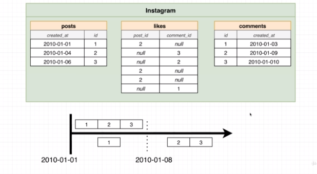

## Section 29 - Optimizing Queries with Materialized Views

### Materialized Views

Views
* Query that gets _executed every time you refer to it_

Materialized Views
* Query that gets executed only at very specific times, but _the results are saved and can be referenced without rerunning the query_

We make use of Materialized Views when we have a very expensive query that might take seconds, minutes or hours to execute. 

Remember we had Simple CTEs and Recursive CTEs. There's a parallel to Views and Materialized Views.

Simple CTEs and Views are convenience tools to make a query easier to understand.

Recursive CTEs and Materialized Views add major functionality.

### Grouping By Week



__For each week, show the number of likes that posts and comments received. Use the post and comment `created_at date, not when the like was received.__

In our image we have a two week span here. We want to take our posts and comments and assign them to one of these two weeks. Above the arrow is a post and below the arrow is a comment.

Then we're going to count all the likes the posts got, and the comments the likes got.

So post with id 2 got a like. Comment with id 3 got a like. etc. So we have this as the result:

| week       | post_likes | comment_likes |
|------------|------------|---------------|
| 2010-01-01 | 3          | 1             |
| 2010-01-08 | 0          | 2             |

### Reminder on Left Joins


So we need to a left join with posts and comments. So basically with a left outer join, if the `post_id` is `null`, then all the columns from `posts` are null, and if the `comment_id` is `null`, then all the columns from `comments` are `null`.

### Writing a Slow Query

```sql
SELECT *
FROM likes
LEFT JOIN posts ON posts.id = likes.post_id
LEFT JOIN comments ON comments.id = likes.comment_id
```

This might take 20-30 seconds to run. Note that each row represents a single like.

So now we have the entire kind of structure of data and values we need. We need to take the `created_at` value and round them down to the nearest week b/c we're grouping likes by each sequential week. We're going to use a function called `DATE_TRUNC`. Pull one piece of information out of timestamp. In this case, we're going to pull out the week. And the `DATE_TRUNC` function is going to round down the information to the nearest unit. Automatically round down `created_at` to nearest week.


```sql
SELECT 
  date_trunc('week', COALESCE(posts.created_at, comments.created_at)) AS week
FROM likes
LEFT JOIN posts ON posts.id = likes.post_id
LEFT JOIN comments ON comments.id = likes.comment_id
ORDER BY week
```

So all these values have been rounded down to the week. We need to summarize these values. We could do a `GROUP BY` and a `COUNT(*)`

```sql
SELECT 
  date_trunc('week', COALESCE(posts.created_at, comments.created_at)) AS week
  COUNT(posts.id) AS num_likes_for_posts,
  COUNT(comments.id) AS num_likes_for_comments
FROM likes
LEFT JOIN posts ON posts.id = likes.post_id
LEFT JOIN comments ON comments.id = likes.comment_id
ORDER BY week
GROUP BY week
```

Remember, `COUNT()` does not count `null` values. So the first week has `num_likes_for_comments` as 0 because there wouldn't be posts for comments in the first week.

So this takes about 2-3 seconds on my machine but might take 10-30 seconds on an older machine.

If we need to run this query many times, 10-30 seconds is a long time. We really need to figure out some more efficient way to increase the performance.

### Createing and Refreshing Material Views

We could improve the performance. We could create an index on the `post_id` or `comment_id` of the likes table. But let's say we don't want to do that.

So one way is to create a materialized view. Only run at very specific times.

So let's take a look how to create a materialized view. 

```sql
CREATE MATERIALIZED VIEW weekly_likes AS (
  SELECT 
    date_trunc('week', COALESCE(posts.created_at, comments.created_at)) AS week
    COUNT(posts.id) AS num_likes_for_posts,
    COUNT(comments.id) AS num_likes_for_comments
  FROM likes
  LEFT JOIN posts ON posts.id = likes.post_id
  LEFT JOIN comments ON comments.id = likes.comment_id
  ORDER BY week
  GROUP BY week
) WITH DATA;
```

`WITH DATA` means when we create the materialized view, we want Postgres to run the query one time and hold onto the results.

So let's try this.

```sql
SELECT * FROM weekly_likes;
```

It took 59 ms and that's including travel time to the server so it's even faster. That's really fast.

Now the one downside to materialized view is if we modify our underlying data, that's not going to modify the cached results in Postgres. We have to tell Postgres it needs to update the view.

Notice the very first week and second week, we have 29 and 31 `num_likes_for_posts`. We're going to delete all posts in our January month because we won't have posts for January anymore.

```sql
DELETE FROM posts
WHERE created_at < '2010-02-01';
```

Looks like we deleted some stuff.

We're going to run this query again:
```sql
SELECT * FROM weekly_likes;
```

But we still have that 29 and 31. So to fix it, we need to tell Postgres to update the Materialized View.

```sql
REFRESH MATERIALIZED VIEW weekly_likes;
```

If we run the select again for `weekly_likes`, we don't have any values for that week of January anymore.

The big downside is we have to tell Postgres we want to rerun the query inside the materialized view.

In general, we only like to make use of Materialized Views whenever we are trying to calculate some values are not going to change very often. This example of finding number of likes, because we probably don't need to rerun this query too often, until say next week.
