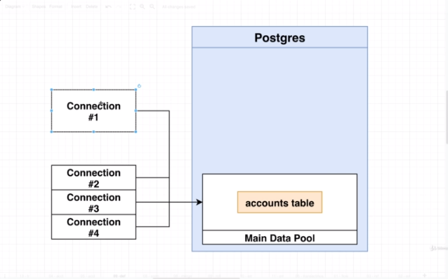

## Section 30 - Handling Concurrency and Reversibility with Transactions

### What are Transactions Used For?

We're going to discuss transactions. Every single piece of documentation uses the same example, and that's because that example is effective. We going to set out a new table inside our instagram database, not related to other tables just for understanding this.

I want to imagine we are working on a database for a bank rather than an instagram database. So one thing we'd need to do in a banking application is transfer money from one account to another. Let's say we'd need to transfer money from Alyson to Gia. In real life, Alyson would just hand money to Gia but we can't do that in a database.


So we might break up the transfer into one statement that subtracts money from Alyson's account and a 2nd statement that adds $50 to Gia's account. This seems simple enough, but there are actually issues that can give us trouble.


__Crash!__
So maybe we're running on AWS, DigitalOcean or your computer. Maybe you run the first update, but it crashed before it added $50 to Gia's account. You might not have any code in place to detect these half-executed transfers. So this would be really bad and hard to recover from. Because we subtracted $50 from Alyson's account but never added it to Gia's account.

### Some Sample Data

So let's create an `accounts` table.

```sql
CREATE TABLE accounts (
  id SERIAL PRIMARY KEY,
  name VARCHAR(20) NOT NULL,
  balance INTEGER NOT NULL
);
```

```sql
INSERT INTO accounts (name, balance)
VALUES
  ('Gia', 100),
  ('Alyson', 100);
```

I'm also going to make sure the data was inserted correctly.

```sql
SELECT * from accounts;
```

### Opening and Closing Transactions



Inside this diagram, we got this Postgres database. Every Query Tool window or everytime you connect to the Postgres database in your application or another tool, you are creating a separate unique connection. So if right-click on instagram database and open up Query Tool, then right-click and open up Query Tool again, that's a 2nd connection.

The data you are looking at is the exact same data as all other connections are seeing.

Let's walk through this process and see how we would run the 2 previous SQL statements in a transaction.

So we use the `BEGIN` keyword to create a transaction. I want you to take note of the solid grey bar, and if I click on it, it says "There is no current transaction." Going to click on play button. Query returned, what does that mean. If I click on that grey icon again, it says "The session is idle in a valid transaction block."

Connection #1 is now in a special state. As soon as we open up a transaction. You can picture in your mind, Postgres creating a separate workspace of data and making a copy of all tables. Now behind the scenes, we are not actually copying any data. This is just a convenient way of imagining it. Only Connection #1 can access data inside this workspace and no other connections are going to see those changes.

I'm going to do:

```sql
UPDATE accounts
SET balance = balance - 50
WHERE name = 'Alyson';
```

So let's check Alyson's account:
```
SELECT * FROM accounts;
```

In Connection #2, let's check again. We see that Alyson's account has not changed.

So let's add to Gia's account now:

```sql
UPDATE accounts
SET balance = balance + 50
WHERE name = 'Gia';
```

If we run the select query inside the 2nd connection, Gia and Alyson still have $100. So how do we merge these changes with the main data pool?

* Run `COMMIT` to merge changes into main data pool
* Run `ROLLBACK` to dump all pending changes and delete the separate workspace
* Running a bad command will put the transaction in an 'aborted' state - you must rollback
* Losing the connection (crashing) will automatically rollback the transaction

So I'll just run `COMMIT` in First Query Tool window. Now we can do `SELECT * FROM accounts` in Second Query Tool window.

### Transaction Cleanup on Crash

I want to simulate a crash. Whenever a crash occurs, Postgres should delete that transaction. I'm going to reset both rows.

```sql
UPDATE accounts
SET balance = 100;
```

Let's open up a transaction by running `BEGIN;` and clicking on play button. Let's withdraw $50 from Alyson's account:
```sql
UPDATE accounts
SET balance = balance - 50
WHERE name = 'Alyson';
```

Now we are in this in-between stage. Now to simulate the crash. I'm going to go on the Dashboard tab. Click on refresh button. See two items pgAdmin 4 - CONN. Represents Query Tool windows. I'm going to terminate both by clicking on the X button.

No transactions running. Postgres should have realized the connection died, and automatically rolled back the transaction. So let's open a new Query Tool Window and do `SELECT * FROM accounts` and we see they both have $100.

### Closing Aborted Transactions

I want to simulate an aborted transaction.
I'll run `BEGIN;` then I'll do `SELECT * FROM asdf;` which just doesn't exist. So then I'm going to do a `SELECT * FROM accounts;` You're going to get an error that the transaction was aborted and everything is going to be ignored until the end of the transaction. So I'm going to a `ROLLBACK` and once again `SELECT * fROM accounts` works.
