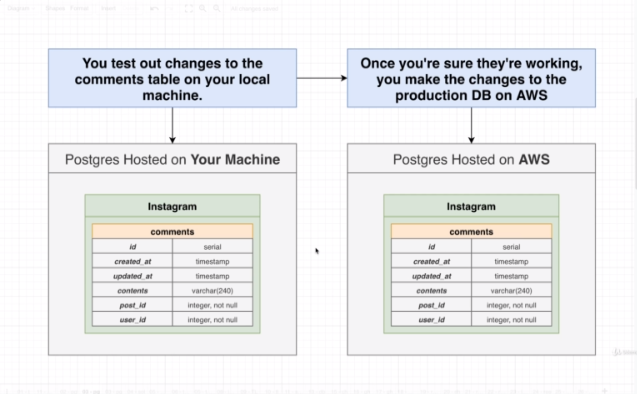
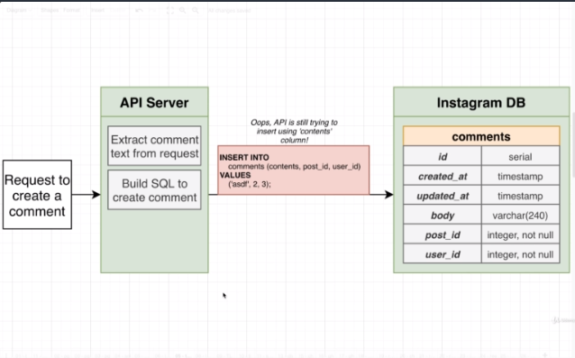
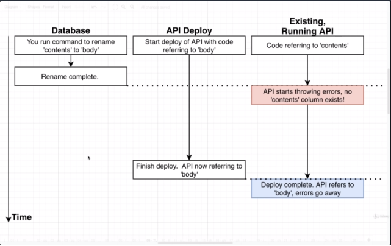

## Section 31 - Managing Database Design with Schema Migrations

### A Story on Migrations

Schema Migrations is a very important topic. Making very careful and well-planned changes to the structure of your database. Adding tables, removing tables, etc. Really important when working with other engineers.

* We're going to walk through a really busy day that you might have working at Instagram
* We'll identify some huge issues that come up when you start changing the structure of your DB
* These are issues that I can almost promise you will run into at some point

__Part I__



You are an engineer at Instagram. You are in charge of managing the `comments` table. You are working with 2 separate copies of Postgres. There are 2 copies of this database. You can test changes on your local machine, and once they're working you then make those changes to the production DB on AWS.

So your actual user database lives inside of the AWS database.

Let's imagine. You show up to work and you get feedback. You hear from other developers that the column name of `contents` is bad. It's hard to remmember whether it's singular or plural.

__Solution - Rename the column!__

It's a very single and easy process. You'd just run
```sql
ALTER TABLE comments
RENAME COLUMN contents TO body;
```

Very inexpensive, fast operation inside of Postgres. So you've seen it works on your local database.

So now you open up pgAdmin and connect to production database in AWS. Lo and behold, __About .001 seconds after making this change, sirens start going off in your office!__



Let's think about the structure of your application. Request coming into an API server. Go to some API server. Extract some comment text from text itself and send off to database. You renamed that column to `body` but you never made any changes to the API server itself. So whenever the API statements builds up some statements it might still be referring to that `contents` column. So you're trying to run some invalid SQL statement.

__Big Lesson #1__:
Changes to the DB structure and changes to clients need to be made at precisely the same time

In other words, if we change `contents` -> `body`, at the same time, all of our different clients are told they need to run new code that will refer to a `body` column.



We've got 3 columns. One for the DB, one for change to API, and one for existing running API. In theory, what you want to do make rename change as you begin to deploy new version of API code that refers to `body` instead of `contents`. 

Now even if you try to make these changes at the same time, you might run into trouble. Deploy might take several seconds to minutes. Window of time where you're still in process of deploying API. 

So the instant that the rename of the column is complete, the existing running API would start throwing errors every time the user tried to insert a new comment because there is no `contents` column anymore. It's only after the new API is deployed would the error go away. 

Anytime you see a company sends you an email that says "We're going to be down from 2-3am on Wednesday morning." or anytime you hear some big company on planned or scheduled downtime, changes to the DB structure is frequently what they're doing.

One way to address this whole situation is just to say "Hey, we're going to take down our entire application. We're going to stop the API running. We're going to make some changes and deploy a new version of our API code, and Ta-dah everything is working as expected."

Howeer, there are many scenarios where you need to make changes to the database and you just plain can't take the application down. You might be working for a company with a SLA (Service-Level Agreement), and in a SLA, you might be required to keep your application up for a vast, vast majority of the year.

So we're going to take a look at a few techniques where a change to the database is not going to cause any errors to occur.

Assuming the DB and API Deploy would happen at the same time and the DB and API Deploy are handled by different teams, it would assume these two different teams of engineers are working together and coordinating on this very important operation.

__Part II__

* Your manager is furious that you broke the app! 
* Moving forward, you are responsible for the comments table ___and___ related changes to the API accessing the DB
* ___Plus___, all of your changes need to be reviewed by another engineer
* Your manager tells you to change `contents` to `body` again using these new procedures

So you make changes to the API Server and Instagram DB and test them locally and confirm they work. You post a Code Review Pull Request on Github for the API.

You made the change to the comments table with handwritten SQL directly in PGADmin. There's nothing in this review request about the SQL that changed _comments_!


So on your machine, you have the `body` column and the API code. Your boss checks out the code, and tests out the API code. Whenever they try to insert a new comment they would get an error there is no `body` column. So your boss would post a comment on the review stating that they got an error.

You might say "Oh. Please run this SQL in PGAdmin." Your boss says okay it looks good and your code review is complete. 

All done with the review, your boss goes back to running the current latest version of the codebase (that doesn't have your changes!). They are once again in a conflicted state. But they've got a version of the database that has a `body` column. Chances are, your boss would come back and say "You just broke everything on my computer. I'm not even running your code anymore. I can't create any comments."

__Big Lesson #2__
When working with other engineers, we need a _really_ easy way to tie the structure of our database to our code
