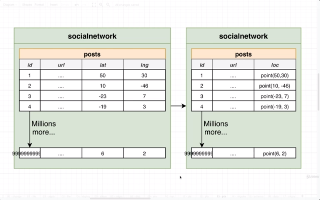

## Section 32 - Schema vs Data Migrations

### Schema vs Data Migrations


One last big topic in world of Schema Migrations.

I want to write out a 3rd migration. In the 3rd migration, we're going to write out a third table called `posts` like the table we had on our `instagram` database.


`posts` is going to have latitude and longitude, representing where in the real world this photo was taken.

We decide to merge down long and lat. We have not discussed data type of Point in Postgres. Represents a coordinate or a point in a 2D plane. Stores an x value and and a y vale. This can safely store x and y values.

Write out a 4th migration merge them down into this single one.



Several months or years might have passed. In that time, we've got many millions of rows added into our posts table. Millions of longitude and latitude pairs and merge them down into our table.

Break these down into a series of steps:
* Add column loc - _Schema_ migration
* Copy lat/lng to loc - _Data_ migration
* Drop columns lat/lng - _Schema_ migration

As a quick reminder, a schema migration is all about adding columns, removing columns, adding tables and removing tables.

Step #1 and Step #3 are definitely Schema Migration steps. Middle step a little bit different. Middle step is not changing the structure of database. It's about moving data around between very different columns. This is referred to as a __Data Migration__. It is a Data Migration because we are moving values between different columns. It turns out handling data migrations and where we write out the SQL for this and whether we place it alongside our schema migrations is a very controversial topic.

### Dangers Around Data Migrations

I just made the claim that there's some kind of difference between a schema migration and a data migration.

Schema migrations changing structure. Data Migrations moving data aroudn.

There are several to not run data migrations at the same time as schema migrations. 

For these 3 steps, are we going to run them in single Migration file or are we going to separate them into 3 migrations?

__Everything in Single Migration__
* Add column loc
* Copy lat/lng to loc
* Drop columns lat/lng

__Split over Separate Migrations__
* Migration #4
  * Add column loc
* ???
  * Copy lat/lng to loc
* Migration #5
  * Drop columns lat/lng

Single Migration
* Add column 'loc'
* Add column complete
* Copy from lat/lng to loc (Copying millions of values! This takes time)
* Copy complete
* Drop columns lat/lng
* Drop complete

Whenever we run a migration, it is common to run it inside a transaction. If anything goes wrong, we want to undo all work done during a migration. We don't want a half-executed state. If anything fails, we rollback the entire transaction. It's a good idea and just about required to run a migration inside a transaction. Almost a hard requirement.

Once we run inside a transaction and start copying data, stuff starts to get really interesting.

__In a Transaction World__
* Open a separate workspace for this copy operation
* Do work
* No errors! Commit the transaction

So the really important thing, instant we open separate workspace, copy of `posts` table at that instant in time.

Then it takes some amount of time to do copy action.

__At the same time outside of the transaction__, our API server is still accepting requests.

So let's imagine in the transaction world, we had 2 posts, because we had 2 posts initially. But then outside of the transaction, we get 2 additional posts created.

The problem is for rows #3 & #4 when we merge lat and lng columns to loc column, they're probably just going to have `null` values. So this is the problem when we use a transaction. We lost some data, and now we are in an erroneous state. This is the big downside of a Data Migration and a Schema Migration at the same time.

### Properly Running Data and Schema Migrations

Time
* Add column loc (at very start allow `null` values)
* Deploy new version of API that will write values to _both_ lat/lng _and_ loc
* Copy lat/lng to loc
* Update code to only write to loc column
* Drop columns lat/lng

Nice thing is you can allow any amount of time to pass between steps. Weeks, months, years.

This is the process I recommend when you have to do a Data Migration and a Schema Migration.

### Creating a Posts Table

We are going to write a migration to add an initial version of our posts table, which has latitude and longitude columns. Then create a web app to view all posts.

Then go through 5 step flow.

### Transaction Locks

There are 2 possible solutions of copying all values from lng & lat to loc column.

__Option #1 - Determine Updates in JS__

```sql
SELECT id, lat, lng
FROM posts
WHERE loc IS NULL;
```

Then run business logic + validation in JS.

```
UPDATE posts
SET loc = ...
WHERE id = ...
```

* Might have many posts and it could crash if we try to load up millions of posts all at once
* Batching (limit to say 5000 posts at a time) could fail halfway through and leaves us in a halfway state
* Requires us to manually connect to the DB from a Nod eenvironment
* We can run complex business logic/validation on the records before doing the update

__Option #2 - SQL!__

```
UPDATE posts
SET loc = ...
WHERE loc IS NULL;

* No moving info between DB and Node - as fast as possible
* Harder to implement validation/business logic
```

__Issue with Both Approaches__

Happens when you get to a couple million rows. Might want to an update in a single transaction. Probably something we want to do.

There is an issue in a long running transaction.

So we might see row 3 here. Location of `null` so we need to do an update. And then internally, this value has been updated. Entire row is going to get _locked_ when the row is updated. It can not be updated until the transaction is commited or rolled back. So no other transaction will succeed.

A Transaction #2 where a user is going to try to update a value, is going to block until the lock is released, which is when Transaction #1 (our bulk update) finishes. 

As an example, let's try this in pgAdmin.

So let's open 2 query tool windows for `socialnetwork`. Now run `BEGIN;` in the first one.

Then run this SQL
``
UPDATE posts
SET lat = 2
WHERE id = 1;
```

Then run this to check on the latitude value
```
SELECT * FROM posts;
```

Then let's try to update:
```
UPDATE posts
SET lat = 10
WHERE id = 1;
```

So this second transaction is waiting for the first transaction to commit or rollback.

The way around this would be do a batched update system, and process only some number of rows at a time. Process 5000, repeat process, etc. Downside is that we can't do entire update in one transaction. Big downside to it.

### Updating Values


