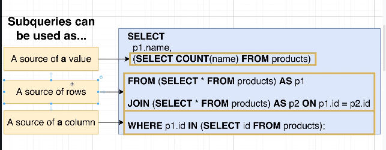
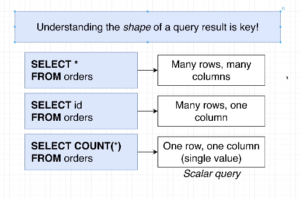
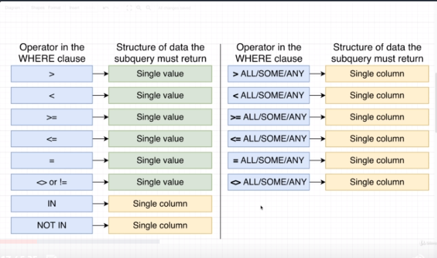

## Section 9 - Subqueries

Right now we want to solve this problem:
List the name and price of all prodcts that are _more expensive than all the products in the 'Toys' department_

We can probably answer this question with just the `products` table.

Right now we have one row in the Toys department which has a price of $876. So we want to find all the products that are more expensive than $876. The only one that's more expensive is the Mouse in the Grocery department for $989. Ultimately we would want to find this row right here. So let's try to write some SQL. There's an easy way and hard way.

Easy way:
```
SELECT name, price
FROM products
WHERE price > 876;
```

This is cheating. We only know the most expensive product in the Toys departments is because we visually saw that. But often we'll have too many rows to visually inspect the table. If we have millions of products, we can't do this.

We would need a query to find the most expensive product. We would need to break it into two different steps or queries. First query finds the most expensive product in the Toys department. Then we'd take the result and put it into a second query that finds all products that are more expensive.

Whenever we find ourselves writing two queries like this, we can instead combine these two separate queries by using a subquery. Let's look at how we would combine these two specific queries.

```sql
SELECT name, price
FROM products
WHERE price > ___
```

So wehere `____` is, that is where would want to insert another query. The second query inside the parentheses will be executed first.


```sql
SELECT name, price
FROM products
WHERE price > (
  SELECT MAX(price)
  FROM products
  WHERE department = 'Toys'
);
```

Note: There is no semicolon inside of the parentheses.

### Thinking About the Structure of Data

We got our first taste of subqueries. Subqueries are known in the world of SQL as being challenging to understand. Let me show you a very extreme example.

```sql
SELECT
  p1.name,
  (SELECT COUNT(name) FROM products)
FROM (SELECT * FROM proudcts) as p1
JOIN (SELECT * FROM proudcts) as p2 ON p1.id = p2.id
WHERE p1.id IN (SELECT id FROM products);
```

Take a look at this. There are 4 separate subqueries. So one of the reasons that understanding subqueries is challenging to understand is because it can appear in many different locations.



The very first one is producting a single value. The two in the middle are producing a source of rows. The last one is producing a single column.

We're going to take a little detour. We're going to focus on understanding the shape of data.



I want to imagine 3 of these queries here and I want you to think about the structure of data when we execute the query. If we ran this first query, I'd expect to get many different rows and many different columsn. If we ran this second query, I'd expect to get many different rows but one single column. And if we ran this last query, I'd expect to get one single row and one single column which we refer to as a Scalar query.

### Subqueries in a Select

As you saw, we can insert different subqueries in different locations. The different subqueries in different locations must return different shapes of data. First scenario is putting in a subquery in SELECT statement. If we want to add a subquery, it must be a subquery that gives a single value or one row and one column.  

For example, this query gives us a single result:
```sql
SELECT MAX(price)
FROM products
```

```sql
SELECT name, price, (
  SELECT MAX(price)
  FROM products
)
FROM products
WHERE price > 867;
```

So right now, this query isn't too meaningful. I'm not too worried about showing you meaningful queries right now. I just want you to get used to idea of making use of subqueries and where we can use them.

### Exercise - Embedding in Select

Write a query that prints the name and price for each phone.  In addition, print out the ratio of the phones price against max price of all phones (so price / max price).  Rename this third column to price_ratio

The result should look something like this. (Only one row is shown, there should be one row for each phone)

| name  | price | price_ratio |
|-------|-------|-------------|
| N1280 | 199   | .498        |

For reference, here is the phones table:

| name        | manufacturer | price | units_sold |
|-------------|--------------|-------|------------|
| N1280       | Nokia        | 199   | 1925       |
| Iphone 4    | Apple        | 399   | 9436       |
| Galaxy S    | Samsung      | 299   | 2359       |
| S5620 Monte | Samsung      | 250   | 2385       |
| N8          | Nokia        | 150   | 7543       |
| Droid       | Motorola     | 150   | 8395       |
| Wave S8500  | Samsung      | 175   | 9259       |

### Subqueries in a From

We are going to take a look at inserting a subquery into a `FROM`.

This is going to be a bit more difficult, because what you can put into a `FROM` clause is much more flexible.

You can put any subquery as long as outer selects/wheres are compatible.

__Gotcha__: A subquery in a `FROM` clause requires an alias to be attached to it (because it's like a table).

So let's take a look at this subquery:
```sql
SELECT name,
price / weight as price_weight_ratio
FROM products
```

Let's go and run that subquery and investigate the structure of data.

So we have two columns, `name` and `price_weight_ratio`. Whenever we write out a subquery in the `FROM` clause, we are saying there's this special source of data that we want to use. Remember that we must apply an alias to the subquery in the `FROM` clause so we can refer to that special source of data later.

So let's take a look at outer query.
```sql
SELECT name, price_weight_ratio
FROM ___________________ AS p
WHERE price_weight_ratio > 5;
```

This query implies with the `SELECT` that `name` and `price_weight_ratio` columns are avaialble through the `FROM` clause.

We have to make sure that the outer `SELECT` is compatible. What does that really mean? If we asked for `price` in the `SELECT` statement, we would get an error because that column does not exist in our subquery in the `FROM` clause. Same thing in `WHERE` clause. If we tried to use `weight` in the `WHERE` clause, we'd also get an error.

You might ask why we would need to use a subquery in the `FROM` clause. Well, this is just for demonstration purposes. For this example you don't really need the subquery.

### From Subqueries that Return a Value

Let's try this subquery:
```sql
SELECT MAX(price)
FROM products;
```

We get `989`. That's one single value. We can use that as long as the outer `SELECT`/`WHERE`/`GROUP BY`/etc. matches. What would work is this:
```sql
SELECT *
FROM ___ as p;
```

So let's run that subquery first, and integrate that into a larger query.

```sql
SELECT *
FROM (SELECT MAX(price) FROM products) as p;
```

Again, this doesn't need the subquery. It's for demonstration purposes.

### Example of a Subquery in a From

__Find the average number of orders for _all_ users__

There is more than one way to solve this. Instead of using 2 subqueries inside of a `SELECT` clause, we are going to use a subquery in the `FROM` clause.

You might group orders by `user_id`. Now that we've counted them up, we've got 7 orders and 4 users, which is 1.75 orders per user.

So we might do a `GROUP BY` and use the `SUM()` aggregate function. There's one little problem here. We can write out a query getting us this far.

```sql
SELECT user_id, COUNT(*)
FROM orders
GROUP BY user_id;
```

Now how do we find the average? We can't just do something like `AVG(COUNT(*))`.
 Also that wouldn't take the average of all the groups. This is where we would make use of a subquery.

```sql
SELECT p.order_count
FROM (
  SELECT user_id, COUNT(*) AS order_count
  FROM orders
  GROUP BY user_id;
) AS p;
```

Now we have a single column of values. So we can apply an aggregate function.

```sql
SELECT AVG(order_count)
FROM (
  SELECT user_id, COUNT(*) AS order_count
  FROM orders
  GROUP BY user_id;
) AS p;
```

So on average a user has 11 orders. Now it's not exactly 11 because we're treating `order_count` as an integer, but we haven't really discussed conversion of values to float.

### Exercise - Subquery From's

Calculate the average price of phones for each manufacturer.  Then print the highest average price. Rename this value to `max_average_price`


For reference, here is the `phones` table:

| name        | manufacturer | price | units_sold |
|-------------|--------------|-------|------------|
| N1280       | Nokia        | 199   | 1925       |
| Iphone 4    | Apple        | 399   | 9436       |
| Galaxy S    | Samsung      | 299   | 2359       |
| S5620 Monte | Samsung      | 250   | 2385       |
| N8          | Nokia        | 150   | 7543       |
| Droid       | Motorola     | 150   | 8395       |
| Wave S8500  | Samsung      | 175   | 9259       |


### Subqueries in a Join Clause

It's really difficult to show you why with our current dataset so this is going to be contrived.

Outer query:
```sql
SELECT first_name
FROM users
JOIN (___
) AS o
ON o.user_id = users.id
```

Subquery:
```sql
SELECT user_id
FROM orders
WHERE product_id = 3
```

Any subquery must return data compatible with the `ON` clause

From the orders table, find rows in `orders` only related to `product_id` of 3. Then use the remaining data with for a `JOIN` with `users`.

```sql
SELECT first_name
FROM users
JOIN (
  SELECT user_id FROM orders WHERE product_id = 3
) AS o
ON o.user_id = users.id
```

So now we can see all users that ordered a product with id of 3.

### More useful - Subqueries with Where

You'll find this quite more often than other subqueries. Now keep in mind there are a couple of operators that can be used with `WHERE`. A subquery is going to be valid or not, depending on the operator (=, >, <, `IN`, etc.).

Let's take a look at this first example.

Outer query:
```
SELECT id
FROM orders
WHERE product_id IN ___
```

Subquery:
```
SELECT id
FROM products
WHERE price / weight > 50;
```

Now we could solve this with a join. Sometimes it's easier to understand with a `WHERE`.

Now you notice you're getting a single column of values. Then you can use it with the `IN` value. `IN` checks whether a value is present within a list of values.  

We can imagine take a look at all different products. Discard all products price / weight < 5 (we changed the subquery to > 50 for the whole data set). So now we have ids 1-7, which are going to provided to the `WHERE` clause. And now the DB is going to go through row by row, and see whether the `product_id` is present within the list. So that is our final dataset there. Now the last thing is for the DB to select the columns, and we're just left with a list of `id`s for order.

```
SELECT id
FROM orders
WHERE product_id IN (
  SELECT id FROM products WHERE price / weight > 50
);
```

### Data Structure with Where Queries

We learned last video that the operator is going to the influence the structure of data we're going to use with the `WHERE` clause.



So with that in mind let's try to write a subquery that will return a single value here:
```sql
SELECT name
FROM products
WHERE price > ___
```

The problem statement is __Show the name of all products with a price greater than the average product price__.

```sql
SELECT AVG(price)
FROM products
```

So our average price is 498. And you notice we get a single value. So we can use this as our subquery.

```sql
SELECT name
FROM products
WHERE price > (
  SELECT AVG(price)
  FROM products
);
```

### Exercise - Subquery Where's

Write a query that prints out the name and price of phones that have a price greater than the Samsung S5620 Monte.

For reference, here is the phones table:

| name        | manufacturer | price | units_sold |
|-------------|--------------|-------|------------|
| N1280       | Nokia        | 199   | 1925       |
| Iphone 4    | Apple        | 399   | 9436       |
| Galaxy S    | Samsung      | 299   | 2359       |
| S5620 Monte | Samsung      | 250   | 2385       |
| N8          | Nokia        | 150   | 7543       |
| Droid       | Motorola     | 150   | 8395       |
| Wave S8500  | Samsung      | 175   | 9259       |

### The Not In Operator With a List

__Show the name of all products that are not in the same department as products with a price less than 100__.

So first you should figure out which operator to use. In this case, it's in the problem. It's `NOT IN`. That means our subquery must return a single column. That contains the departments that have products with a price less than 100.

Outer query:
```sql
SELECT name
FROM products
NOT IN ___;
```

Subquery:
```
SELECT department
FROM products
WHERE price < 100;
```

So now we're going to merge the results of these two queries together. Going to print out department too.

```sql
SELECT name, department
FROM products
NOT IN (
  SELECT department FROM products WHERE price < 100
);
```

### A New Where Clause

We're going to making use of an operator we have not used.

__Show the name, department, and price of products that are more expensive than all products in the 'Industrial' department.__

First, we need to find all products in the Industrial department. So we have two rows with 327 and 796. Now we're going to look at all our rows and drop them ones than are greater than the prices in these two rows.

One way we could solve this is using a `MAX(price)` aggregate function. For the purposes of this video, I'm going to use a different way.

We're going to make use of the `> ALL` operator.

```sql
SELECT name, department, price
FROM products
WHERE price > ALL ___
```

```sql
SELECT price
FROM products
WHERE name = 'Industrial';
```

```sql
SELECT name, department, price
FROM products
WHERE price > ALL (
  SELECT price
  FROM products
  WHERE name = 'Industrial'
);

### Finally Some!

Let's imagine this.  

`50 > SOME` -> `(20, 100)`  

This checks that 50 is greater than at least one of the two values.

If the greater than sign was reversed, we would check that 50 is less than at least one of the two values.
```

__Show the name of products that are more expensive than at least one product in the 'Industrial' department.__

```sql
SELECT name, department, price
FROM products
WHERE price > SOME (
  SELECT price
  FROM products
  WHERE department = 'Industrial'
);
```

### Exercise - Practice Your Subqueries!

Write a query that print the name of all phones that have a price greater than any phone made by Samsung.

For reference, here is the phones table:

| name        | manufacturer | price | units_sold |
|-------------|--------------|-------|------------|
| N1280       | Nokia        | 199   | 1925       |
| Iphone 4    | Apple        | 399   | 9436       |
| Galaxy S    | Samsung      | 299   | 2359       |
| S5620 Monte | Samsung      | 250   | 2385       |
| N8          | Nokia        | 150   | 7543       |
| Droid       | Motorola     | 150   | 8395       |
| Wave S8500  | Samsung      | 175   | 9259       |

### Probably Too Much About Correlated Subqueries

One last topic about subqueries. Something called a correlated subquery.

__Show the name, department, and price of the most expensive product in each department.__

Now when you first look at this problem, it might look easy to solve, but as you look as it, you'll realize it's more difficult.

First we need to find all unique departments. We would then find the most expensive product for each department, dropping the other rows for that department. So that is what we are going for. See each department one time, and that row should have the most expensive price. Let's write out a quick subquery.

Outside query:
```
SELECT name, department, price
FROM products
WHERE price ___ ___
```

Subquery:
```sql
SELECT MAX(price)
FROM products
WHERE department = 'Industrial'
```

Note that department is hardcoded, but let's just see how it works for now. 

How Where Clause works.
Goal of `FROM` some number of rows to iterate over. All the rows are then fed into and iterated over with `WHERE`.

Think about outside qery. We have this row come in and the `WHERE` gets executed. Second row come in, `WHERE` gets executed. And so on.

When we get a row, the subquery gets executed. It itself might fetch some number rows, and then execute `WHERE` for every row in the subquery that's been fetched. 

You can imagine this as a double nested for loop. For every row in the outer query, we are going to iterate over rows in the subquery.

I'm going to make a change to both queries;

Outside query:
```
SELECT name, department, price
FROM products AS p1
WHERE price ___ ___
```

Subquery:
```sql
SELECT MAX(price)
FROM products AS p2
WHERE p2.department = 'Industrial'
```

We are just being very explicit with `p2.department`. `p1.price` is talking that cell right there, and `p2.department` is really talking about this value. Distinct cells by making use of aliases.

Last thing to understand correlated query. Think of this as a double nested for loop. We still have this p1 row out here. We can refer to values from this outer row in p1 from the subquery.

We could do this:
```sql
SELECT MAX(price)
FROM products AS p2
WHERE p2.department = p1.department
```

And it's going to iterate over all the products rows in the subquery and only keep them if the match the department in p1. So we have 3 rows for the Industrial department, and then we get drop 2 rows and get 876 for the very first row in p1.

So we for the outer query we'd want it to be `WHERE p1.price = 876` where `876` is in place of the subquery.

So this will be the final query:
```sql
SELECT name, department, price
FROM products AS p1
WHERE p1.price = (
  SELECT MAX(price)
  FROM products AS p2
  WHERE p1.department = p2.department
);
```

So that is a correlated subquery. A correlated subquery means that we are referring to some row from the outside query in the inner query or in the subquery.

### A Select Without a From?

We can place the `SELECT` keyword and any subquery that returns one single value.

```sql
SELECT (
  SELECT MAX(price) FROM products
);
```

This is useful if you're trying to calculate one single value that is the result of several single values. Quick example. Find the ratio of the maximum priced item to the lowest price item. We could do this:

```sql
SELECT (
  SELECT MAX(price) FROM products
) / (
  SELECT MIN(price) FROM products
);
```

We can also do this:
```sql
SELECT (
  SELECT MAX(price) FROM products
), (
  SELECT MIN(price) FROM products
);
```

### Exercise - From-less Selects

Using only subqueries, print the max price, min price, and average price of all phones.  Rename each column to `max_price`, `min_price`, `avg_price`.

The result should look something like this:

| max_price | min_price | avg_price |
|-----------|-----------|-----------|
| ...       | ...       | ...       |

For reference, here is the phones table:

| name        | manufacturer | price | units_sold |
|-------------|--------------|-------|------------|
| N1280       | Nokia        | 199   | 1925       |
| Iphone 4    | Apple        | 399   | 9436       |
| Galaxy S    | Samsung      | 299   | 2359       |
| S5620 Monte | Samsung      | 250   | 2385       |
| N8          | Nokia        | 150   | 7543       |
| Droid       | Motorola     | 150   | 8395       |
| Wave S8500  | Samsung      | 175   | 9259       |

